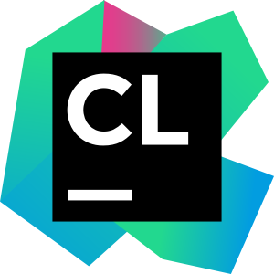

EE205 Animal Farm
=================

Animal Farm is a series of labs intended to teach the basics of C and C++.  
It's also intended to introduce good Software Engineering practices.  Students 
are expected to "Live" in this project as the code evolves over a series of 
requirements.

#### Links
The project's home page (hosted by GitHub) is [here](https://github.com/marknelsonengineer/ee205_animal_farm)

The source code documentation (hosted by UH) is [here](https://www2.hawaii.edu/~marknels/ee205/ee205_animal_farm)

#### Toolchain
This project is the product of a tremendous amount of R&D and would not be possible without the following world-class tools:

| Tool           | Website                     |                                                Logo                                                 |
|----------------|-----------------------------|:---------------------------------------------------------------------------------------------------:|
| **gcc**        | https://gcc.gnu.org         |      |
| **llvm/clang** | https://clang.llvm.org      |     |
| **CLion**      | https://jetbrains.com/clion |    |
| **CMake**      | https://cmake.org           |    |
| **Doxygen**    | https://doxygen.nl          |  |
| **DOT**        | https://graphviz.org        |      |
| **Boost**      | https://boost.org           |    |
| **Git**        | https://git-scm.com         |      |
| **GitHub**     | https://github.com          |   |
| **Linux**      | https://kernel.org          |    |
| **ArchLinux**  | https://archlinux.org       |   |
| **VirtualBox** | https://www.virtualbox.org  |  |
